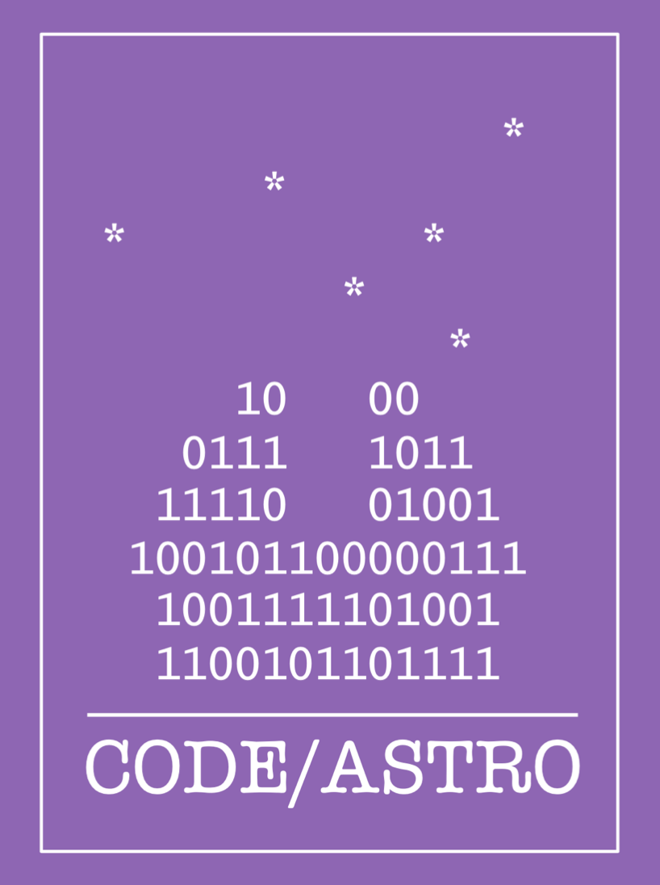

### ** Python packages**

Plenty of information is online, but you can check the following links to release a Python package through PyPI (`pip install`). 

- [Code/Astro](https://github.com/semaphoreP/codeastro/tree/main)

Code/Astro is a workshop aiming to teach astronomers good practice to develope open source Python packages. Applications for [Code/Astro 2024](https://semaphorep.github.io/codeastro/) are open, don't miss this amazing opportunity!

- [Science and Commit](https://github.com/Science-and-Commit/Workshop_2022)

Science and Commit is an adapted version of Code/Astro that I did with Paula Cáceres, Rafael Martínez, and José Vines. It aims to increase collaboration among Spanish-speaking students during the pandemic in Chile.

